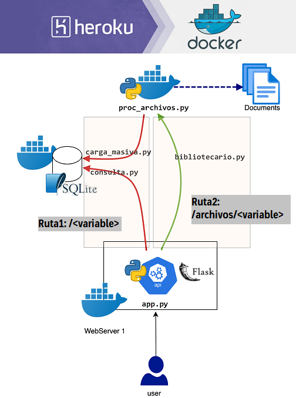

Desafio MeLi - API REST - Frecuencia Palabras

Documentación e instrucciones de la app:

ENUNCIADO:
Se requiere desarrollar un sistema que permita obtener la frecuencia de términos de un una colección de documentos a través de una API Rest.

Se provee una colección de 172 archivos .txt en los cuales se deberá buscar las ocurrencias de término o palabra. El término a buscar se se pasa como variable en la URL usando http_GET y la API deberá devolver la cantidad de ocurrencias de 
este término entre todos los .txt.

SOLUCION:
Se decide generar dos rutas para esta API:

Ruta-1 /<variable> --> busca la palabra en la base de datos y devuelve la ocurrencia de esta palabra en todos los documentos. En esta opción los documentos fueron pre-procesados y se cargó cada palabra y su frecuencia en la DB. En la URL se debe agregar el término a buscar. Ej: "computadora"
     GET https://desafiomeli.herokuapp.com/computadora
     RESPONSE: {  "cantidad": 9}

Ruta-2 /archivos/<variable> --> procesa todos los arhivos buscando y contando la ocurrencia de la palabra. Devuelve el listado de archivos en los que aparece la palabra y la frecuencia en cada uno y la cantidad total de ocurrencias. Ej: "computadora"
   GET https://desafiomeli.herokuapp.com/archivos/computadora
   RESPONSE: {
              "archivos": [
                {
                  "archivo": "30716-8.txt", 
                  "cantidad": 6
                }, 
                {
                  "archivo": "27034-8.txt", 
                  "cantidad": 3
                }
              ], 
              "cantidad": "9"
            }

ARQUITECTURA:

